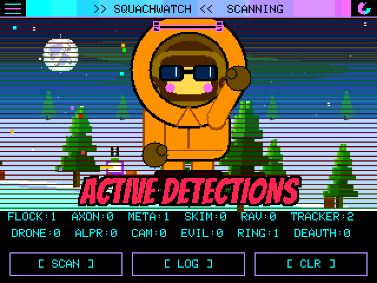

# SquachWatch-CYD

> Surveillance-device detector for the ESP32-2432S028R ("Cheap Yellow Display").
> Built for the **TALKING SASQUACH** brand family.

SquachWatch-CYD sniffs the 2.4 GHz airwaves for known wireless signatures
of Flock Safety cameras, Axon body cameras, recording glasses, card
skimmers, AirTags, drones, proximity beacons and pentest hardware. It runs
standalone on a bare CYD board — no PC, no extras, just plug it into USB.

The UI is a vaporwave-themed take on the **SquachWare** aesthetic: matrix
digital rain, Squachy the mascot, full-screen dramatic ALERT overlays, and
the glitchy SquachWatch wordmark.

<p align="center">
  <a href="https://squachwatch.com/emulator/" title="Drive it in your browser">
    
  </a>
</p>

<p align="center">
  <b>That is the firmware itself, not a mockup.</b><br>
  Every frame above was rendered by the same C++ that runs on the board,
  compiled for a PC.<br>
  <a href="https://squachwatch.com/emulator/"><b>Click it to drive it in your browser &rarr;</b></a>
</p>

## What it detects

| Type | What | How |
|---|---|---|
| `FLOCK` | Flock Safety ALPR cameras | 29 WiFi OUI prefixes + BLE name + company ID `0x09C8` |
| `AXON` | Axon body cameras, TASERs, LE equipment | 3 WiFi OUI + SSID prefixes `AB2-`/`AB3-`/`AB4-`/`AXON-` |
| `META` | Camera glasses — Ray-Ban Meta, Snap Spectacles | BLE service UUID `0xFD5F` + Meta / Luxottica / Snap company IDs |
| `SKIMMER` | Bluetooth card skimmers (HC-05/06/03, RN42, BT04-A) | BT Classic name match + SPP UUID `0x1101` + 3 OUI |
| `RAVEN` | Raven gunshot detector | Service UUIDs `0x3100`–`0x3500` |
| `AIRTAG` | Apple AirTag / Find My trackers | Company ID `0x004C` + Find My payload check |
| `DRONE` | Remote ID drones | Service UUID `0xFFFA`, then the ASTM F3411 message **decoded** — aircraft position, altitude, serial, and the operator's location |
| `ALPR` | Motorola Solutions / Genetec plate readers | 6 WiFi OUI |
| `CAMERA` | Generic / covert IP cameras | 17 WiFi OUI (Wyze, Amazon, Tuya, Verkada, Avigilon, Axis, …) |
| `SAMSUNG_TAG` | Samsung Galaxy SmartTag / SmartTag+ | BLE service UUID `0xFD5A` |
| `GOOGLE_TAG` | Google Find My Device trackers (Chipolo, Pebblebee, Moto Tag) | BLE service UUID `0xFEAA` |
| `TILE` | Tile BLE trackers | BLE service UUID `0xFEED` / `0xFEEC` |
| `RING` | Ring doorbells / cameras | 15 WiFi OUI (Ring LLC's registered block + Amazon's) |
| `DEAUTH` | WiFi deauthentication floods | Rate-detected burst, not a signature |
| `EVILTWIN` | Rogue / spoofed access points | One SSID beaconing from two BSSIDs that disagree about encryption |
| `IBEACON` | Retail proximity beacons | Exact Apple header `4C 00 02 15` — **off by default**, see below |
| `HACKER` | Flipper Zero, Pwnagotchi, WiFi Pineapple, ESP deauthers | Flipper's service UUIDs `0x3081`–`0x3083`, company ID `0x0E29` and OUI `0C:FA:22`; the Pwnagotchi's own beacon payload; `Pineapple_` and `pwned` SSIDs |

### Confidence is per signature, not per type

Every hardware prefix in the firmware was checked against the IEEE registry
rather than against other detectors. Of 76 rows: **32 High, 4 Medium, 40
Low**.

That grading matters most on `FLOCK`, where exactly **one** of 29 prefixes is
registered to Flock Safety and the rest are the generic Espressif and Liteon
parts they build on — real evidence, shared with every dev board on earth.
`ALERT FILTER` is a minimum-confidence gate, so setting it to High keeps a
passing ESP32 in the log without taking over the screen.

The audit also removed `00:0E:58`, which sat here for eleven releases
labelled "Vigilant" and is registered to **Sonos**. Every speaker in range
was being logged as a plate reader.

`IBEACON` ships switched off — not a judgement about importance, one about
volume. One shop can put more beacons in range than this device would
otherwise see all week. It is one tap away in `DETECTION FILTER`.

## Hardware

- **ESP32-2432S028R** ("Cheap Yellow Display" / CYD) — about $15.
  Built-in 320×240 ILI9341 TFT, XPT2046 resistive touch, and an
  onboard microSD card slot.

That's it. No buzzer, no GPS, no extra modules. The CYD is the
whole device.

## Web Flash

No build tools, no IDE, no cloning anything — flash a board straight
from your browser:

**[https://squachwatch.com/](https://squachwatch.com/)**

Works in Firefox, Chrome, Edge, or Brave on desktop. Pick your board (2.8" CYD
or AWOK 2.4"), plug in, click Connect & Install, done.

## Build

Three steps:

1. Install [PlatformIO](https://platformio.org/) (CLI or VS Code extension).
2. Clone the repo:
   ```sh
   git clone https://github.com/skizzophrenic/SquachWatch-CYD
   cd SquachWatch-CYD
   ```
3. Build and flash:
   ```sh
   pio run -t upload
   ```

The first build pulls the TFT_eSPI, XPT2046, and NimBLE-Arduino
libraries; after that it's incremental.

A full beginner-friendly walkthrough is in [docs/BUILD.md](docs/BUILD.md).

## Usage

1. Plug the CYD into USB-C.
2. The splash runs for a second and a half, stamped with the build's own
   version (from `git describe`, so a working-tree build says so).
3. The main screen appears: your chosen background, Squachy, and live
   per-type counters. He says something reassuring every thirty seconds.
4. The three soft buttons at the bottom:
   - **`[ SCAN ]`** — return to the main (idle) screen.
   - **`[ LOG ]`** — open the rolling 200-entry detection log.
   - **`[ CLR ]`** — wipe the log and return.
5. When something is detected, the device **flashes a full-screen ALERT**:
   a header strip in the detection's own colour with the type in the
   Bangers face, a data plate with the vendor, the device's own name where
   it broadcasts one, its MAC and a signal meter, and a gauge showing what
   was found with the instrument grid over it. Tap anywhere to dismiss
   early, or it clears itself after 60 seconds.

If a microSD card is present, every detection is also appended to
`squachwatch-<day>.log` (CSV: `ts,type,rssi,mac,channel,vendor,ssid`).
There is no GPS and no network sync — the clock is set over serial with a
single `TIME <epoch>` line at 2,000,000 baud, and until it is, timestamps
count from boot.

## Every outfit

Squachy has fourteen costumes. Most are earned by detection count; four are
hidden behind things nobody tells you about, on the background they belong
to. Two of them are in the animation at the top of this page.

<p align="center">
  
</p>

No fabricated marketing shots, which was the promise here before there was
anything to show. Every panel above was drawn by the firmware, one render
per costume, and the labels are read out of the source rather than typed
next to it — so a renamed or newly added outfit cannot end up captioned
wrongly. Regenerate with `python3 make_gallery.py` in `sim/`.

## Project layout

```
SquachWatch-CYD/
├── platformio.ini
├── README.md
├── LICENSE
├── docs/
│   ├── FAQ.md                    (what it does, hardware, legality)
│   ├── DESIGN.md                 (the contract — single source of truth)
│   ├── BUILD.md                  (friendly walkthrough)
│   ├── PINOUT.md                 (CYD pin map)
│   ├── DETECTIONS.md             (per-signature provenance)
│   └── SQUACHWARE-AESTHETIC.md   (CSS → RGB565 mapping)
├── include/
│   ├── state.h                   (DetectionType, Detection, Confidence)
│   ├── theme.h                   (palette, backgrounds, icons, chrome)
│   ├── signatures.h              (the tables and their lookups)
│   ├── detection.h
│   ├── remote_id.h               (ASTM F3411 decoder)
│   ├── clock.h                   (wall clock, set over serial)
│   ├── ignore_list.h             (per-device alert suppression)
│   ├── settings.h
│   ├── squachy.h                 (the mascot)
│   ├── bangers_font.h            (generated 1bpp display face)
│   ├── cyd_user_setup.h          (TFT_eSPI config for the CYD)
│   └── ui_*.h
├── src/
│   ├── main.cpp                  (setup/loop, state machine, touch)
│   ├── theme.cpp                 (backgrounds, per-type icons, chrome)
│   ├── squachy.cpp               (the mascot, his outfits and his lines)
│   ├── signatures.cpp
│   ├── detection.cpp             (WiFi promiscuous + NimBLE scan)
│   ├── remote_id.cpp
│   ├── clock.cpp
│   ├── ignore_list.cpp
│   ├── pet.cpp
│   ├── sd_log.cpp
│   └── ui_*.cpp
├── test/                         (host tests -- `make -C test`, no framework)
└── sim/                          (PC emulator — compiles src/ natively)
    ├── Makefile                  (`make` for the CLI, `make wasm` for the web build)
    ├── *.h                       (Arduino/TFT_eSPI/NVS shims)
    ├── make_demo.py              (renders the animation at the top of this file)
    ├── make_gallery.py           (renders the outfit sheet above)
    ├── make_social.py            (renders the repo's social preview card)
    └── web/                      (the browser build)
```

## License

**GNU General Public License v3.0 (GPL-3.0).** See [LICENSE](LICENSE).

## Credits

- Flock Safety OUI research: [@NitekryDPaul](https://x.com/NitekryDPaul),
  DeFlockJoplin, [`colonelpanichacks/flock-you`](https://github.com/colonelpanichacks/flock-you)
  (MIT).
- Generic-camera OUI table: [`skizzophrenic/Cardputer-CSI-Human-Detector`](https://github.com/skizzophrenic/Cardputer-CSI-Human-Detector)
  (MIT, this author's earlier work).
- Axon / skimmer / SSID prefix data: compiled with assistance from
  Gemini (Google), expanded against public sources.
- AirTag manufacturer-data format: public Apple FindMy spec.
- AWOK 2.4" board port (ESP32-Marauder V6.1 hardware): **bkbroiler**,
  who did the actual pin-mapping and shared-bus touch-calibration work
  that made this board possible.
- The SquachWare vaporwave aesthetic and `TALKING SASQUACH` brand
  belong to **skizzophrenic / Talking Sasquach** — see
  [talkingsasquach.com](https://talkingsasquach.com) and the
  [SquachWare-CFW](https://github.com/skizzophrenic/SquachWare-CFW)
  project.
- Vibes: also skizzophrenic, who vibecoded most of this at unreasonable
  hours with an AI doing the typing. Yes, the same guy credited above
  for "research." Make of that what you will.

## Status

**Shipping.** Releases are cut by pushing a `v*.*.*` tag; the flasher above
is rebuilt and redeployed by the same CI run, so the web flasher always
matches the newest release.

Detection is reliable for the high-priority targets (Flock, Axon, skimmer,
camera glasses). Remote ID and iBeacon are exact-format matches. Raven,
generic ALPR and the Google tracker network are best-effort — see
[docs/DETECTIONS.md](docs/DETECTIONS.md) for per-signature provenance and
the confidence each one earns.

Verified on real hardware. There is also a PC emulator in `sim/` that
compiles the actual `src/` against shims, and a host test suite in `test/`
(`make -C test`) covering the decoders, the signature tables and the
emulator's own fidelity to the display library.
